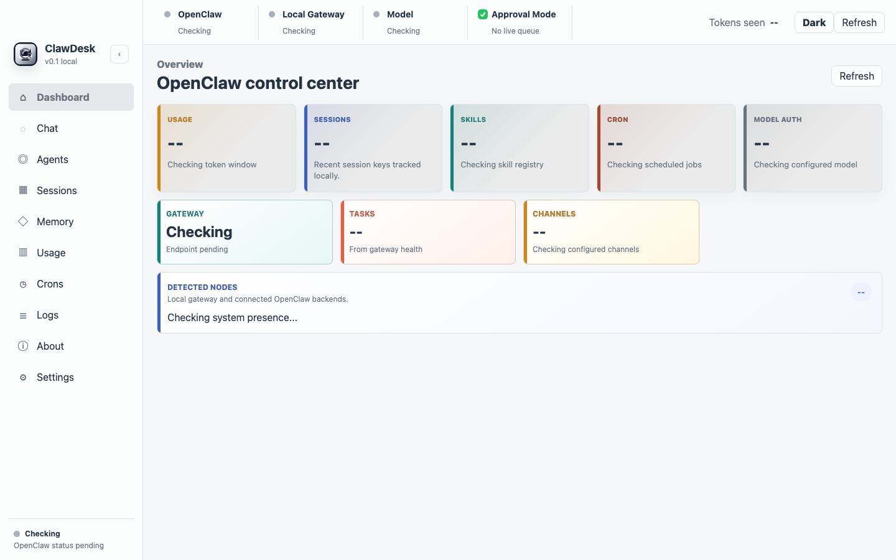
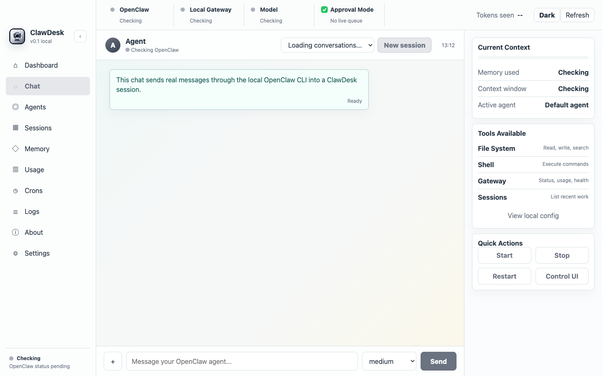
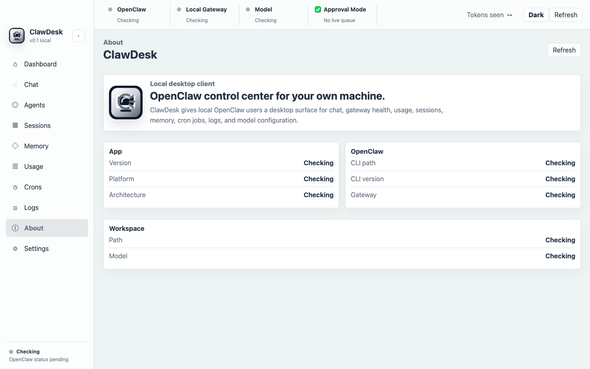

# ClawDesk

Desktop control center for a local OpenClaw install.

ClawDesk gives OpenClaw users a cross-platform Electron app for chat, gateway health, usage, sessions, memory files, cron jobs, logs, model configuration, and local quick actions.



## Screenshots





## Features

- Chat through the local `openclaw agent` CLI.
- Attach files in chat with the `+` button. ClawDesk saves them into the OpenClaw workspace and gives the agent the local paths.
- View Gateway status, health, node presence, and log tail.
- Inspect recent sessions, configured agents, workspace memory files, skills, and cron jobs.
- Review local usage estimates from `openclaw gateway usage-cost`.
- Change the default OpenClaw model from the Settings panel.
- Start, stop, and restart the local Gateway.
- Works on macOS, Windows, and Linux from one Electron codebase.

## Requirements

- OpenClaw installed locally.
- Node.js and npm for development builds.
- macOS, Windows, or Linux.

## Install From Release

Download the artifact for your platform from the GitHub release:

- macOS: `ClawDesk-0.1.1-universal.dmg`
- Windows installer: `ClawDesk.Setup.0.1.1.exe`
- Windows portable: `ClawDesk.0.1.1.exe`
- Linux AppImage: `ClawDesk-0.1.1.AppImage`
- Linux archive: `clawdesk-0.1.1.tar.gz`

The current builds are unsigned. macOS and Windows may show security warnings on first launch.

## Run Locally

```bash
npm install
npm start
```

## Build

```bash
npm run build:mac
npm run build:win
npm run build:linux
```

Release files are written to `release/`.

## Current Status

This is a v0.1 local desktop build. It is useful for testing and early OpenClaw users, but it is not notarized, code-signed, or packaged with an OpenClaw installer.

Known limits:

- Windows builds currently use the default Electron icon.
- Linux `.deb` is not shipped from macOS cross-builds; use AppImage or tar.gz.
- Native approval queue UI is not wired yet.
- ClawDesk expects an existing local OpenClaw install.

## License

All rights reserved. See [LICENSE](LICENSE).
